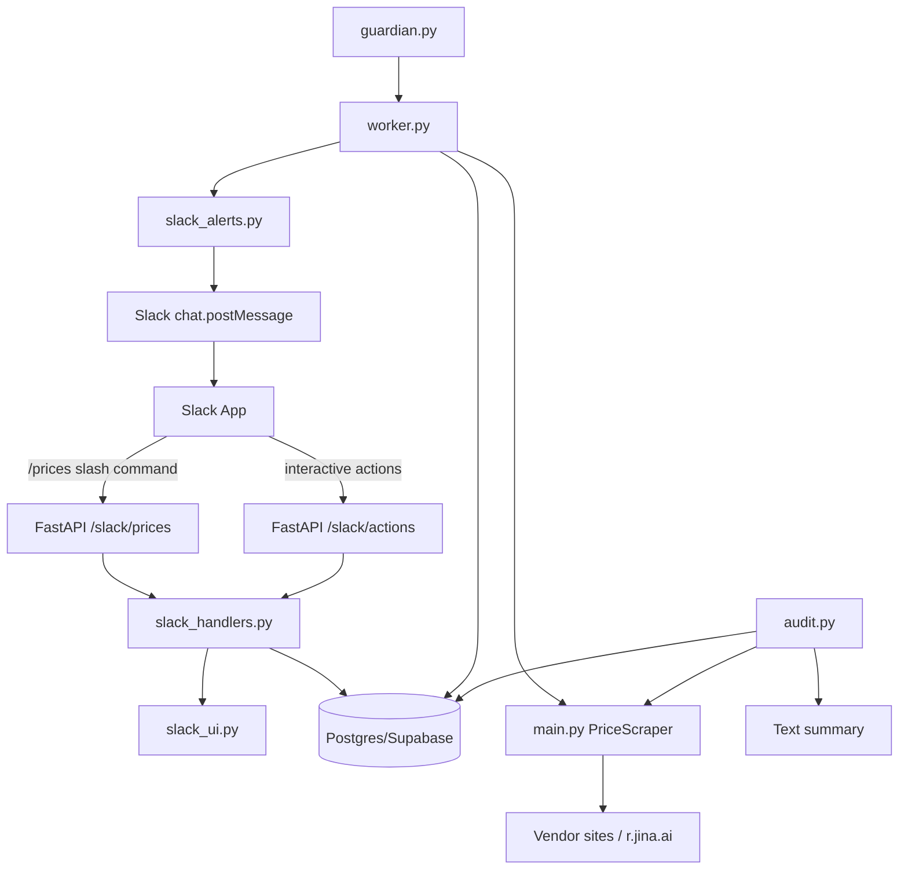

# Vantageflow Guardian Overview

This repo implements the "Guardian" price monitoring system with a separate on-demand audit formatter.

## Architecture


## 1) Database Structure (the Blueprint)
Parent table: ClientProduct (the "North Star").
Example fields:
- Name: "H1 Pro"
- URL: hinomi.co/...
- Slack Channel: #hinomi-alerts

Child table: CompetitorTrack (the "Targets").
Example fields:
- Name: "FlexiSpot E7"
- URL: flexispot.com/...
- Last Price: 499.00

The parent-child relationship is defined in the database schema. SQLModel models are kept in `models.py` as a reference schema.

## 2) Worker Logic (the Brain)
Every run (typically every 4 hours), the worker:
1) Scrapes the client's CURRENT price live (not from DB).
2) Sends one initial "monitoring activated" Slack alert when:
   - a product is seen for the first time, or
   - its `slack_channel_id` changes to a different channel.
3) Scrapes each competitor's current price.
4) If the competitor price changed vs. `last_price`, it:
   - Computes the gap vs. the current client price.
   - Sends a Slack alert with the change and the gap.
   - Updates `last_price` (and `last_checked`).
5) If no change, it logs the check and moves on.

Simplified flow (matches the intent of `worker.py`):

```python
def check_all_prices():
    products = session.query(ClientProduct).all()
    for product in products:
        current_client_price = scraper.get_price(product.base_url)
        for comp in product.competitors:
            current_comp_price = scraper.get_price(comp.url)
            if current_comp_price != comp.last_price:
                diff = current_client_price - current_comp_price
                send_slack_alert(
                    channel=product.slack_channel_id,
                    msg=f"Price Change! {comp.name} is now ${current_comp_price}. "
                        f"You are ${diff} more expensive than them."
                )
                comp.last_price = current_comp_price
                session.add(comp)
    session.commit()
```

Note: The actual implementation also stores `last_checked` for each competitor and talks to Supabase via the REST API.

## 3) Slack UI Logic (the Dashboard)
- `/prices` command: queries ClientProduct rows for a given Slack Team ID and returns a list of products.
- Product selection: loads CompetitorTrack rows for that product_id and returns a Block Kit list of competitors with their latest prices.
- `/all-products` command: returns a single Slack message with all products and their competitors for the team.
- App mention (optional): when someone mentions the bot, it replies with a short help menu.

## 4) Why this is the Pro way
- Dynamic baselines: If the client changes their own price, the next alert calculates the new gap correctly because it scrapes live.
- No duplicate alerts: Only alert on price changes by comparing to `last_price`.
- Clean logs: You can add a PriceHistory table later for graphs and trendlines.

## Audit Formatter (separate from worker)
The audit formatter is a separate on-demand script (`audit.py`). It scrapes current prices and prints a copy-paste summary for outreach emails.

## Quickstart
1) Set environment variables:
   - `SUPABASE_URL` (ex: `https://<ref>.supabase.co`)
   - `SUPABASE_SERVICE_ROLE_KEY` (server-side only; never ship to the browser)
   - `SLACK_BOT_TOKEN`
   - `SLACK_SIGNING_SECRET`
   - Optional: `CHECK_INTERVAL_HOURS` (default 4), `GUARDIAN_MODE` (`once` or `forever`), `GUARDIAN_STATE_FILE` (default `.guardian_state.json`)

2) Ensure your DB schema includes the `last_checked` column for `CompetitorTrack`.

3) Run the API (for Slack slash commands):
```bash
uvicorn api:app --host 0.0.0.0 --port 8000
```

4) Run the Guardian loop (price monitoring):
```bash
GUARDIAN_MODE=forever CHECK_INTERVAL_HOURS=4 python guardian.py
```

5) Run an on-demand audit:
```bash
python audit.py --product-id 123
```
Add `--pdf` to write a PDF summary (auto-named), or provide a path:
```bash
python audit.py --product-id 123 --pdf
python audit.py --product-id 123 --pdf /tmp/audit_123.pdf
```
